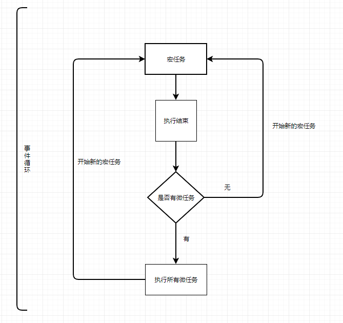

# 事件循环(EventLoop)与任务队列(Event Queue)

> 众所周知javascript是单线程的，那么是如何实现异步的呢，没错，就是事件循环（EventLoop）

* 宏任务(macro-task)
  * script（全局任务，每一个js文件也是一个宏任务）, setTimeout, setInterval, I/O
* 微任务(micro-task)
  * Promise.then， process.nextTick(node)

## 浏览器中的事件执行机制

执行机制是先执行宏任务再执行所有的微任务

流程图如下：



分析如下代码：

 ```bash
setTimeout(function() {
    console.log('setTimeout');
},0)

new Promise(function(resolve) {
    console.log('promise');
    resolve();
}).then(function() {
    console.log('then');
    return Promise.resolve('then2');
}).then(function(res){
     console.log(res);
})

console.log('console');
// 输出顺序为：promise，console，then，then2，setTimeout
 ```

* 执行setTimeout，放入Event Table中，指定时间之后，将回调函数放入宏任务的Event Queue中
* new Promise 同步代码执行构造函数输出`console.log('promise')`,将微任务then放入微任务Event Queue中
* 执行`console.log('console');`
* 主线程宏任务执行完毕，检查是否存在微任务，存在微任务,执行所有的微任务输出`then,then2`，第一轮事件循环结束
* 第二轮事件循环开始，获取下一个宏任务，即setTimeout的回调函数，然后查找是否有微任务，没有，时间循环结束

## 宏任务，微任务在浏览器和 node 环境执行顺序不同

```bash
// 这个列子里面，包含了宏任务，微任务，分别看看浏览器和node 打印的结果
console.log(1)
// 栈
setTimeout(()=>{
    console.log('setTimeout1')
    // 微任务
    Promise.resolve(100).then(()=>{
        console.log('promise')
    })
})
// 栈
let promise = new Promise((resolve, reject)=>{
    console.log(2)
    resolve(4)
}).then((data)=>{
    // 微任务
    console.log(data)
})
// 栈
setTimeout(()=>{
    console.log('setTimeout2')
})
console.log(3)
// 浏览器结果: 1,2,3,4,setTimeout1,promise,setTimeout2
// node 结果: 1,2,3,4,setTimeout1,setTimeout2,promise
```

> 浏览器是先把一个栈以及栈中的微任务走完，才会走下一个栈。node 环境里面是把所以栈走完，才走微任务

### nextTick 和 then 都属于微任务，谁优先执行呢？

```bash
process.nextTick(function(){
    console.log('nextTick')
})
Promise.resolve().then(function(){
    console.log('then')
})
// 结果打印：nextTick then
```

> nextTick 会比 其他微任务执行快