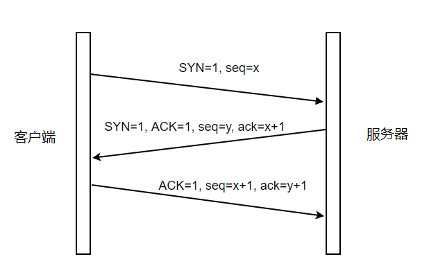

# 性能优化需要知道的基础知识(HTTP)

\***\*HTTP 协议是建立在 TCP 协议之上的应用层协议所以 HTTP 协议的瓶颈及其优化都是基于 TCP 协议本身的特性的\*\***

## 从 URL 输入到页面展现到底发生了什么？

总体来说分为以下过程

- DNS 解析: 将域名解析成 IP 地址

- TCP 链接: TCP 三次握手

- 发送 HTTP 请求

- 服务器处理请求并返回 HTTP 报文

- 浏览器解析渲染页面

- 断开连接：TCP 四次挥手

### DNS 解析查找过程

- 浏览器缓存>操作系统缓存>路由缓存>ISP 的 DNS 服务器>根服务器

### TCP 特性

- TCP 是一种无状态的、面向连接的、可靠的字节流服务

- 在一个 TCP 连接中，仅有两方进行彼此通信。广播和多播不能用于 TCP

- TCP 使用校验和，确认和重传机制来保证可靠传输

- TCP 给数据分节进行排序，并使用累积确认保证数据的顺序不变和非重复

- TCP 使用滑动窗口机制来实现流量控制，通过动态改变窗口的大小进行拥塞控制

注意：TCP 并不能保证数据一定会被对方接收到，TCP 能够做到的是，如果有可能，就把数据递送到接收方，否则就（通过放弃重传或者中断连接这一手段）通知用户。因此准确说 TCP 也不是 100% 可靠的协议，它所能提供的是数据的可靠递送或故障的可靠通知。

### TCP 三次握手

- 第一次握手,客户端发送连接请求到服务端 `SYN=1, seq=x` ; 客户端进入 SYN_SEND 状态，等待服务器的确认

- 第二次握手,服务端响应请求 `SYN=1, ACK=1, seq=y, ack=x+1`; 服务器进入 SYN_RECV 状态

- 第三次握手，客户端响应服务器 `ACK=1, seq=x+1, ack=y+1`; 客户端和服务器端都进入 ESTABLISHED 状态

"三次握手"总共经历：请求---应答---再次确认，目的是为了防止已失效的连接请求报文段突然又传送到了服务端，因而产生错误。

举个栗子：

> “已失效的连接请求报文段”的产生在这样一种情况下：client 发出的第一个连接请求报文段并没有丢失，而是在某个网络结点长时间的滞留了，以致延误到连接释放以后的某个时间才到达 server。本来这是一个早已失效的报文段。但 server 收到此失效的连接请求报文段后，就误认为是 client 再次发出的一个新的连接请求。于是就向 client 发出确认报文段，同意建立连接。假设不采用“三次握手”，那么只要 server 发出确认，新的连接就建立了。由于现在 client 并没有发出建立连接的请求，因此不会理睬 server 的确认，也不会向 server 发送数据。但 server 却以为新的运输连接已经建立，并一直等待 client 发来数据。这样，server 的很多资源就白白浪费掉了。采用“三次握手”的办法可以防止上述现象发生。例如刚才那种情况，client 不会向 server 的确认发出确认。server 由于收不到确认，就知道 client 并没有要求建立连接。

### SYN 攻击

\***\*什么是 SYN 攻击？\*\***

在三次握手过程中，服务器发送 SYN-ACK 之后，收到客户端的 ACK 之前的 TCP 连接称为半连接(half-open connect)。此时服务器处于 SYN_RCVD 状态。当收到 ACK 后，服务器才能转入 ESTABLISHED 状态。SYN 攻击指的是，攻击客户端在短时间内伪造大量不存在的 IP 地址，向服务器不断地发送 SYN 包，服务器回复确认包，并等待客户的确认。由于源地址是不存在的，服务器需要不断的重发直至超时，这些伪造的 SYN 包将长时间占用未连接队列，正常的 SYN 请求被丢弃，导致目标系统运行缓慢，严重者会引起网络堵塞甚至系统瘫痪。SYN 攻击是一种典型的 DoS/DDoS 攻击。

\***\*如何检测 SYN 攻击？\*\***

检测 SYN 攻击非常的方便，当你在服务器上看到大量的半连接状态时，特别是源 IP 地址是随机的，基本上可以断定这是一次 SYN 攻击。在 Linux/Unix 上可以使用系统自带的 netstats 命令来检测 SYN 攻击。

\***\*如何防御 SYN 攻击？\*\***

SYN 攻击不能完全被阻止，除非将 TCP 协议重新设计。我们所做的是尽可能的减轻 SYN 攻击的危害，常见的防御 SYN 攻击的方法有如下几种：

- 缩短超时（SYN Timeout）时间

- 增加最大半连接数

- 过滤网关防护

- SYN cookies 技术

### 浏览器解析渲染页面

- 根据 HTML 解析出 DOM 树

- 根据 CSS 解析生成 CSS 规则树

- 结合 DOM 树和 CSS 规则树，生成渲染树

- 根据渲染树计算每一个节点的信息

- 根据计算好的信息绘制页面

#### 根据 HTML 解析 DOM 树

- DOM 树解析的过程是一个深度优先遍历。即先构建当前节点的所有子节点，再构建下一个兄弟节点。

- 在读取 HTML 文档，构建 DOM 树的过程中，若遇到 script 标签，则 DOM 树的构建会暂停，直至脚本执行完毕。

#### 根据 CSS 解析生成 CSS 规则树

- 解析 CSS 规则树时 js 执行将暂停，直至 CSS 规则树就绪。

- 浏览器在 CSS 规则树生成之前不会进行渲染。

#### 结合 DOM 树和 CSS 规则树，生成渲染树

- DOM 树和 CSS 规则树全部准备好了以后，浏览器才会开始构建渲染树。

- 精简 CSS 可以加快 CSS 规则树的构建，从而加快页面相应速度。

#### 根据渲染树计算每一个节点的信息（布局）

- 布局：通过渲染树中渲染对象的信息，计算出每一个渲染对象的位置和尺寸

- 回流：在布局完成后，发现了某个部分发生了变化影响了布局，那就需要倒回去重新渲染。

#### 根据计算好的信息绘制页面

- 绘制阶段，系统会遍历呈现树，并调用呈现器的“paint”方法，将呈现器的内容显示在屏幕上。

- 回流：某个元素的尺寸发生了变化，则需重新计算渲染树，重新渲染。

- 重绘：某个元素的背景颜色，文字颜色等，不影响元素周围或内部布局的属性，将只会引起浏览器的重绘。

### TCP 四次挥手

客户端或服务器均可主动发起挥手动作, 举个栗子：

- 第一次挥手：Client 发送一个 FIN，用来关闭 Client 到 Server 的数据传送，Client 进入 FIN_WAIT_1 状态。

- 第二次挥手：Server 收到 FIN 后，发送一个 ACK 给 Client,Server 进入 CLOSE_WAIT 状态。

- 第三次挥手：Server 发送一个 FIN，用来关闭 Server 到 Client 的数据传送，Server 进入 LAST_ACK 状态。

- 第四次挥手：Client 收到 FIN 后，Client 进入 TIME_WAIT 状态，发送 ACK 给 Server，Server 进入 CLOSED 状态

简单来说：Client 表示没有数据要传输给 Server，Server 应答这次请求（这个时候 Server 可能还有数据要传输给 Client，只是单方面关闭 Client 到 Server 的数据传输通道），Server 表示没有数据给 Client，Client 应答这次请求，总共经历四次挥手

## HTTP 的发展变化

### HTTP1.0 和 HTTP1.1 的区别

- 长连接，HTTP 1.1 支持长连接（PersistentConnection）和 HTTP 管线化（Pipelining）处理，在一个 TCP 连接上可以传送多个 HTTP 请求和响应，减少了建立和关闭连接的消耗和延迟。HTTP1.1 默认支持长连接。HTTP1.1 在同一时间对于同一个域名的请求数量有限制，超过限制就会阻塞请求

- 节约带宽，HTTP1.0 中，存在一些浪费带宽的现象，例如客户端只是需要某个对象的一部分，而服务器却将整个对象送过来了，并且不支持断点续传功能，HTTP1.1 则在请求头引入了 range 头域，它允许只请求资源的某个部分，即返回码是 206（Partial Content），这是支持文件断点续传的基础。支持只发送 header 信息，可以用作权限请求。

- 错误通知的管理，在 HTTP1.1 中新增了 24 个错误状态响应码，如 409（Conflict）表示请求的资源与资源的当前状态发生冲突；410（Gone）表示服务器上的某个资源被永久性的删除。

- HOST 域，在 HTTP1.0 中认为每台服务器都绑定一个唯一的 IP 地址，因此，请求消息中的 URL 并没有传递主机名（hostname）。但随着虚拟主机技术的发展，在一台物理服务器上可以存在多个虚拟主机（Multi-homed Web Servers），并且它们共享一个 IP 地址。HTTP1.1 的请求消息和响应消息都应支持 Host 头域，且请求消息中如果没有 Host 头域会报告一个错误（400 Bad Request）。

### HTTP2.0 新特性

- 二进制分帧：HTTP 2.0 性能增强的核心，全在于新增的二进制分帧层，它定义了如何封装 HTTP 消息并在客户端与服务器之间传输。

- 多路复用:做到同一个连接并发处理多个请求。HTTP2.0 使用 HPACK 算法对 header 的数据进行压缩。

- 头部压缩：在 HTTP1.x 中，首部元数据都是以纯文本形式发送的，通常会给每个请求增加 500~800 字节的负荷。为减少这些开销并提升性能，HTTP 2.0 会压缩首部元数据。

- 服务器推送

### HTTPS

基于 HTTP 协议，通过 SSL 或 TLS 提供加密处理数据、验证对方身份以及数据完整性保护。

实现原理流程：

- 客户端向服务端发送请求

- 服务端把数字证书发送给客户端：数字证书包含的信息有证书的办法机构，过期时间，服务端的公钥，服务端的域名信息，以及证书颁发机构的签名等内容

- 客户端解析证书，这部分工作是 SSL/TLS 来完成，首先使用证书的公钥进行验证签名，确保证书的真实有效，如果证书没问题那么就生成一个秘钥(对称加密)，然后使用证书里面解析出来的服务端公钥对该秘钥进行加密，然后传输给服务端。

- 服务端通过私钥解密，得到客户端传输过来的私钥信息

- 客户端与服务器进入加密通信，就完全是使用普通的 HTTP 协议，只不过用"密钥"加密内容。

> 数字签名：对内容进行 hash 运算生成摘要（digest）然后使用私钥对摘要进行加密生成签名（signature），签名是为了保证信息的真实性和完整性

### 常见的状态码

- 200 OK 客户端请求成功

- 301 Moved Permanently 请求永久重定向

- 302 Moved Temporarily 请求临时重定向

- 304 Not Modified 文件未修改，可以直接使用缓存的文件。

- 400 Bad Request 由于客户端请求有语法错误，不能被服务器所理解。

- 401 Unauthorized 请求未经授权。这个状态代码必须和 WWW-Authenticate 报头域一起使用

- 403 Forbidden 服务器收到请求，但是拒绝提供服务。服务器通常会在响应正文中给出不提供服务的原因

- 404 Not Found 请求的资源不存在，例如，输入了错误的 URL

- 500 Internal Server Error 服务器发生不可预期的错误，导致无法完成客户端的请求。

- 503 Service Unavailable 服务器当前不能够处理客户端的请求，在一段时间之后，服务器可能会恢复正常。

## 性能优化实践

- 减少 HTTP 请求数

- 避免重复的资源请求：这种情况主要是由于疏忽或页面由多个模块拼接而成，然后每个模块中请求了同样的资源时，会导致资源的重复请求

- 减少 DNS 查找

- 重用 TCP 连接

- 减少 HTTP 重定向。HTTP 重定向需要额外的 DNS 查询、TCP 握手等非常耗时，最佳的重定向次数为 0

- 使用 CDN（内容分发网络）：把数据放在离用户地理位置更近的地方，可以明显减少每次 TCP 连接的网络延迟

- 缓存必要的应用资源，避免每次都重复请求相同的内容

- 传输数据之前应该先压缩应用资源，把要传输的字节减少到最小，在压缩的时候确保对每种不同的资源采用最好的压缩手段

- 消除不必要的请求开销：减少请求的 HTTP 首部数据（比如 HTTP cookie）

- 并行处理请求和响应
